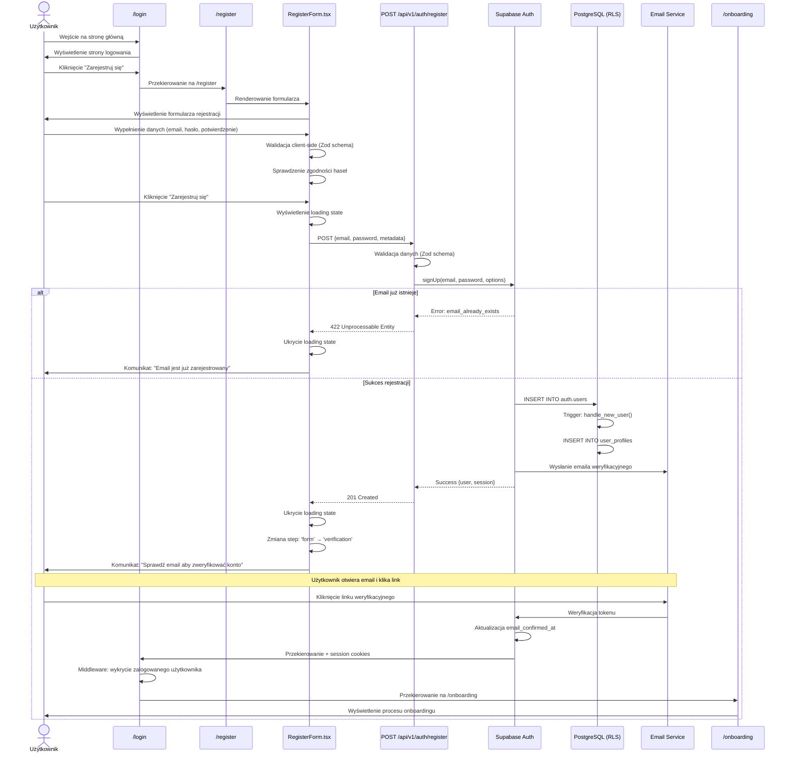
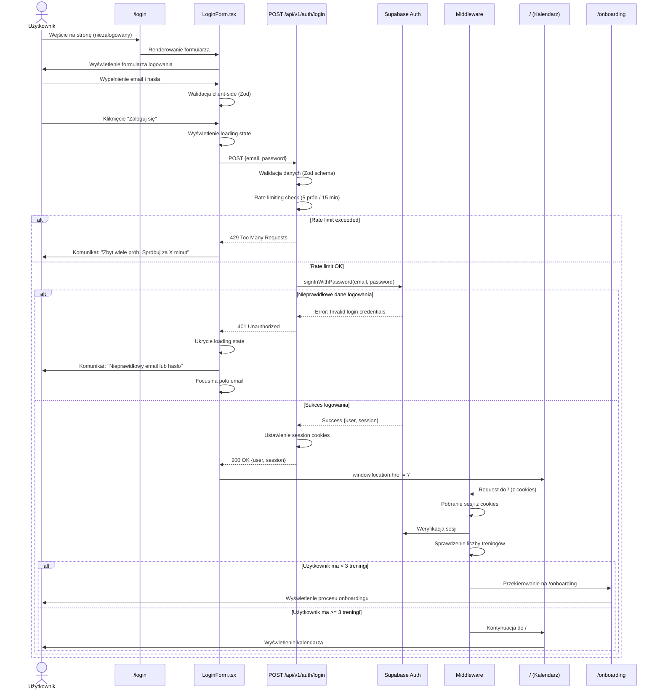
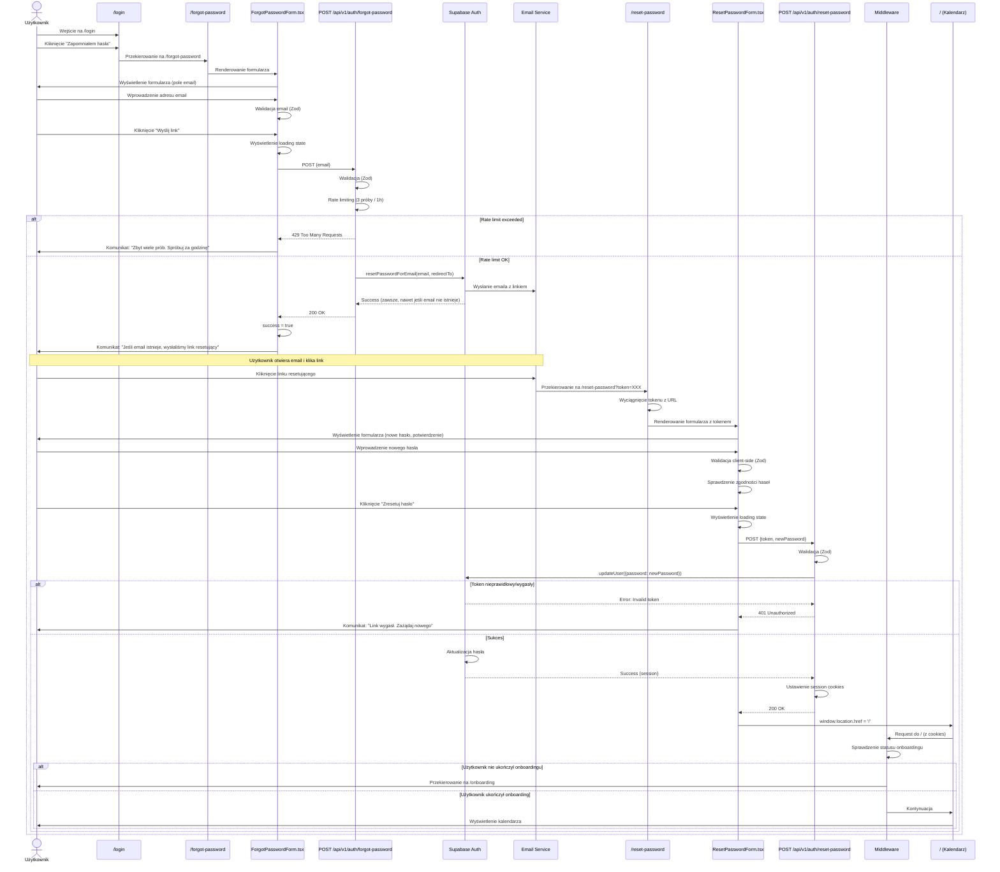
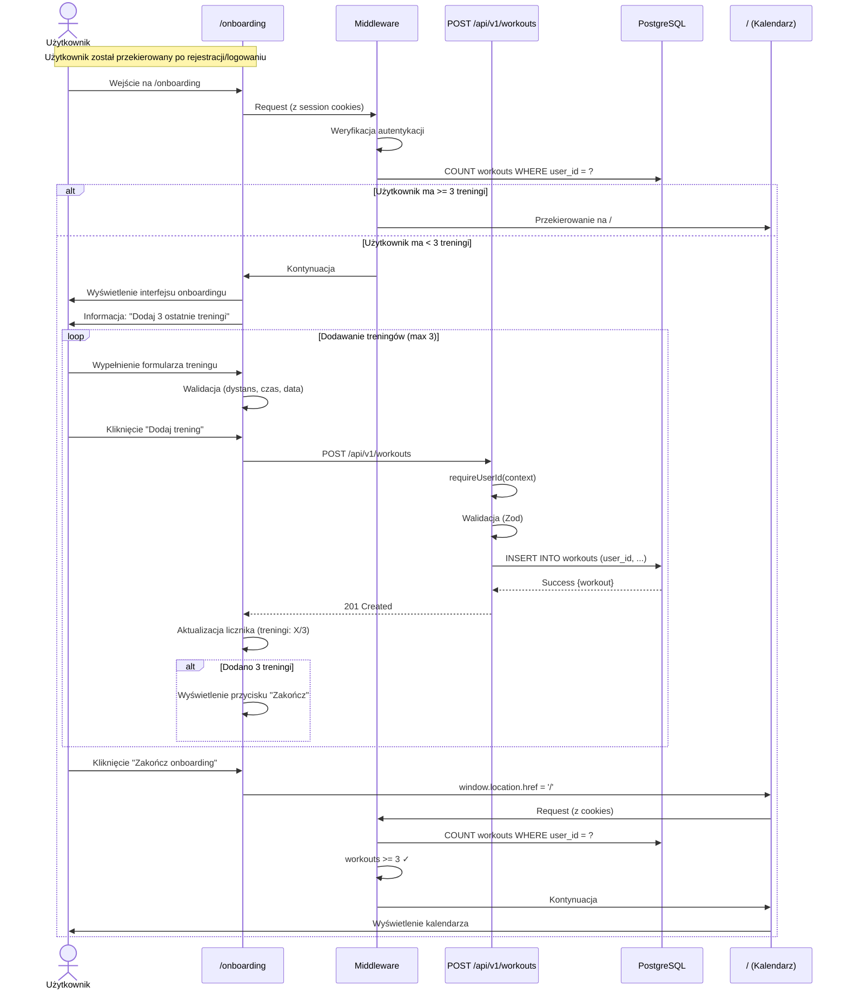
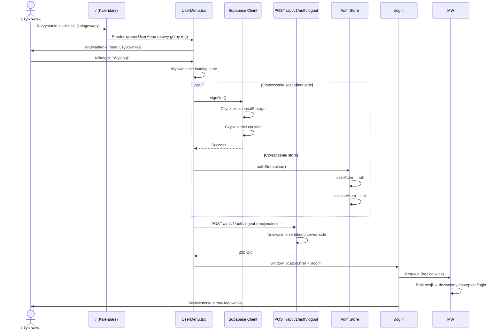
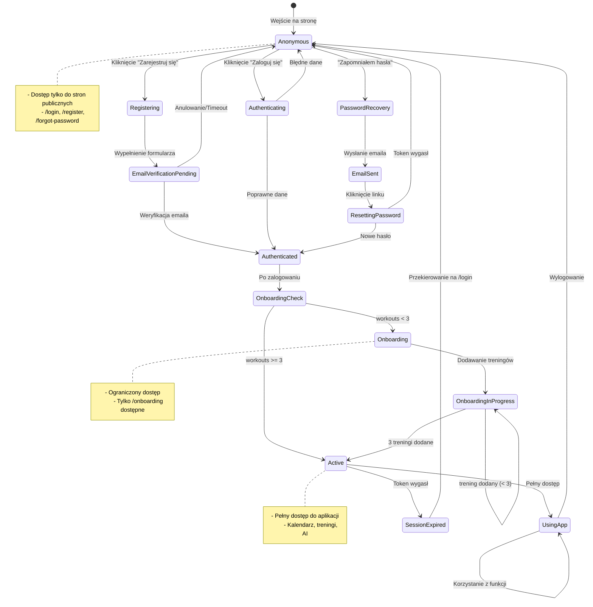
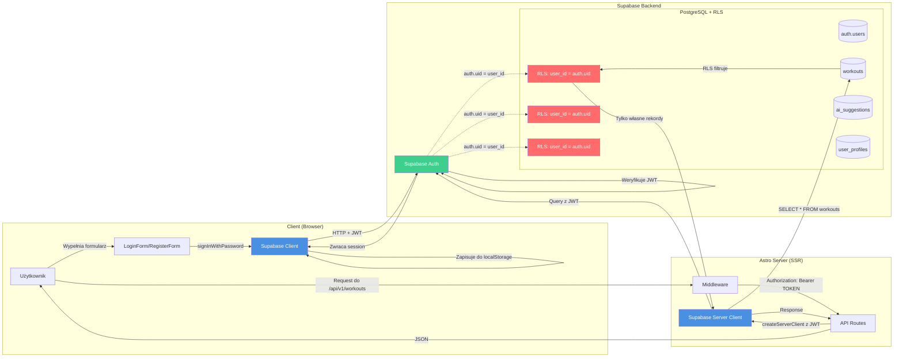
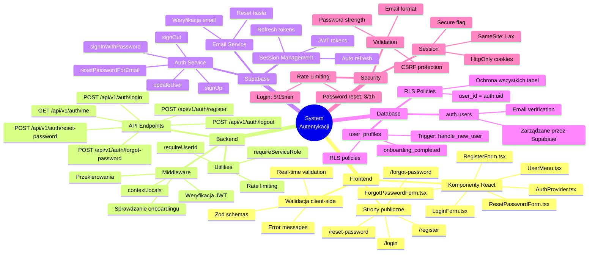

# Authentication Journey - Mermaid Diagrams

## 1. Główny Przepływ Użytkownika (User Journey)


## 2. Przepływ Rejestracji (Registration Flow)



## 3. Przepływ Logowania (Login Flow)



## 4. Przepływ Odzyskiwania Hasła (Password Recovery Flow)



## 5. Przepływ Onboardingu (Onboarding Flow)



## 6. Przepływ Wylogowania (Logout Flow)



## 7. Diagram Stanów Użytkownika (User State Diagram)



## 8. Architektura Middleware i Ochrony Tras (Route Protection)

```mermaid
flowchart TD
    Start([Request]) --> MW[Middleware]
    MW --> CheckPath{Sprawdź ścieżkę}

    CheckPath -->|/api/v1/auth/*| AllowAPI[Zezwól na API auth]
    CheckPath -->|/login, /register, etc.| CheckPublic{Czy zalogowany?}
    CheckPath -->|Inne ścieżki| CheckAuth{Czy zalogowany?}

    CheckPublic -->|Tak| RedirectHome[Przekieruj na /]
    CheckPublic -->|Nie| AllowPublic[Renderuj stronę publiczną]

    CheckAuth -->|Nie| RedirectLogin[Przekieruj na /login?redirectTo=...]
    CheckAuth -->|Tak| CheckOnboarding{Sprawdź onboarding}

    CheckOnboarding -->|Ścieżka = /onboarding| AllowOnboarding[Renderuj /onboarding]
    CheckOnboarding -->|Inna ścieżka| CountWorkouts[COUNT workouts]

    CountWorkouts --> WorkoutsCheck{workouts >= 3?}
    WorkoutsCheck -->|Nie| RedirectOnboarding[Przekieruj na /onboarding]
    WorkoutsCheck -->|Tak| SetContext[Ustaw context.locals]

    SetContext --> AddUser[context.locals.user]
    AddUser --> AddSupabase[context.locals.supabase]
    AddSupabase --> Next[next()]

    AllowAPI --> Next
    AllowPublic --> Next
    AllowOnboarding --> Next
    RedirectHome --> End([Response])
    RedirectLogin --> End
    RedirectOnboarding --> End
    Next --> Handler[Route Handler]
    Handler --> End

    style MW fill:#4A90E2,color:#fff
    style CheckAuth fill:#F5A623,color:#fff
    style CheckOnboarding fill:#F5A623,color:#fff
    style RedirectLogin fill:#E74C3C,color:#fff
    style RedirectOnboarding fill:#E74C3C,color:#fff
    style Next fill:#27AE60,color:#fff
```

## 9. Integracja z Row Level Security (RLS)



## 10. Podsumowanie - Kluczowe Elementy Systemu



---

## Notatki Implementacyjne

### Status Implementacji w Codebase

#### ✅ ZAIMPLEMENTOWANE:
1. **Middleware** - `/src/middleware/index.ts`
   - Weryfikacja JWT z Authorization header
   - Per-request Supabase client (RLS support)
   - Sprawdzanie statusu onboardingu
   - Przekierowania do /onboarding

2. **Auth Utilities** - `/src/lib/http/auth.ts`
   - `requireUserId()` - wymaga user JWT
   - `requireServiceRole()` - wymaga service-role key

3. **Supabase Client** - `/src/db/supabase.client.ts`
   - Browser-side Supabase client
   - Konfiguracja z env variables

4. **UserMenu Component** - `/src/components/UserMenu.tsx`
   - Logout functionality
   - Redirects to /login after logout

5. **Database RLS**
   - Wszystkie tabele mają RLS enabled
   - Polityki: `user_id = auth.uid()`
   - Foreign keys do `auth.users(id)`

6. **Test Script** - `/.curls/auth-test-user.sh`
   - Tworzenie/logowanie test usera
   - Zwraca JWT token

#### ❌ NIE ZAIMPLEMENTOWANE (z tej specyfikacji):
1. Strony: `/login`, `/register`, `/forgot-password`, `/reset-password`
2. Komponenty: `LoginForm`, `RegisterForm`, etc.
3. API endpoints: `/api/v1/auth/*`
4. Validation schemas (Zod)
5. AuthService class
6. Auth Store (nanostores)
7. Rate limiting
8. E2E tests dla auth flows

### Kolejność Implementacji (Zalecana)

1. **Faza 1: Podstawowe strony i formularze**
   - `/login.astro` + `LoginForm.tsx`
   - `/register.astro` + `RegisterForm.tsx`
   - Walidacja Zod dla obu formularzy

2. **Faza 2: API endpoints**
   - `POST /api/v1/auth/login`
   - `POST /api/v1/auth/register`
   - `POST /api/v1/auth/logout`

3. **Faza 3: Password recovery**
   - `/forgot-password.astro` + `ForgotPasswordForm.tsx`
   - `/reset-password.astro` + `ResetPasswordForm.tsx`
   - `POST /api/v1/auth/forgot-password`
   - `POST /api/v1/auth/reset-password`

4. **Faza 4: Auth store i session management**
   - `authStore.ts` (nanostores)
   - `AuthProvider.tsx`
   - Auto refresh logic

5. **Faza 5: Security i polish**
   - Rate limiting
   - Error handling improvements
   - E2E tests
   - User profiles migration

### Zgodność z PRD

Wszystkie diagramy są zgodne z wymaganiami z `.ai/prd.md`:

- ✅ **Bezpieczny dostęp** (Punkt 60-73)
  - Dedykowane strony logowania i rejestracji
  - Wymaganie email + hasło
  - Brak zewnętrznych serwisów logowania
  - Odzyskiwanie hasła
  - Wylogowanie z przekierowaniem

- ✅ **Onboarding** (Punkt 32-36)
  - Wymagane 3 treningi przed dostępem do głównej aplikacji
  - Automatyczne przekierowanie po rejestracji
  - Sprawdzanie statusu w middleware

- ✅ **Chronione funkcjonalności** (Punkt 68)
  - Generowanie treningów: wymaga auth
  - Zarządzanie treningami: wymaga auth
  - Kalendarz: wymaga auth
  - Widok detali: wymaga auth

### Technologie i Integracje

- **Framework**: Astro 5 (SSR mode)
- **Auth Provider**: Supabase Auth
- **Database**: PostgreSQL (Supabase)
- **Validation**: Zod
- **State Management**: nanostores
- **UI Components**: React 19 + Tailwind 4
- **Testing**: Playwright (E2E)
